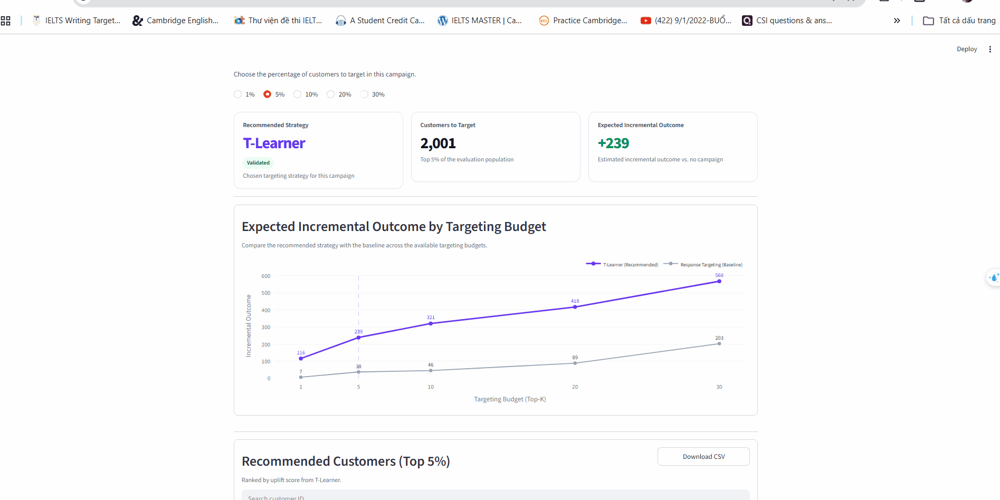

# Customer Selection with Uplift Modeling

> A customer-targeting data science project that combines dataset-specific analysis with a shared uplift-modeling evaluation framework.

## Demo Dashboard



The final dashboard turns model outputs into a targeting decision: choose a campaign budget, view the recommended strategy, expected incremental outcome, comparison with the Response baseline, and export the ranked customer list.

---

## Project Overview

This project studies **when uplift modeling provides a useful targeting advantage over conventional Response modeling** across three datasets: **Criteo, Hillstrom, and RetailHero**.

The work is not only about testing a reusable framework. Each dataset requires its own Data Science process before modeling:

- Data understanding, cleaning, and EDA
- Treatment and outcome definition
- Leakage checks and feature engineering
- Analysis of the data conditions behind the modeling results.

After the data is modeling-ready, the same shared framework is used to train and evaluate targeting policies consistently.

---

## Datasets and Results

| Dataset | Data setting | Primary budget | Recommended policy | What the experiment showed |
|---|---|---:|---|---|
| **Criteo** | 13.98M rows, ~85/15 Treatment-Control, `visit` and `conversion` | Top 5% | **Visit: X-Learner** · **Conversion: Response** | The same data can lead to different targeting decisions for different outcomes. |
| **Hillstrom** | Mens/Womens email experiments, near-balanced Treatment-Control, `visit` and `conversion` | Top 20% | **Response** for all four experiments | Uplift champions were found, but none had enough validation evidence to replace the baseline. |
| **RetailHero** | 200,039 customers, randomized near-balanced campaign, transaction history summarized into 58 leakage-safe features | Top 5% | **T-Learner** | T-Learner passed the validation replacement gate; its locked-test point estimate remained higher, although the paired confidence interval included zero. |

Across the completed experiments, uplift modeling does **not** win in every dataset or outcome. The results therefore emphasize both the modeling method **and the characteristics of the data being modeled**. Because the datasets differ in several ways at once, the project does not claim that any single data characteristic causes the different results.

---

## Project Workflow

```text
Dataset-specific Data Science
raw data
   ↓
cleaning + EDA
   ↓
treatment / outcome definition
   ↓
feature engineering + leakage checks
   ↓
prepared modeling dataset

                 ↓

Shared uplift framework
train Response + T-Learner + X-Learner
   ↓
validation policy evaluation
   ↓
select uplift champion at the primary Top-K budget
   ↓
paired-bootstrap replacement gate vs Response
   ↓
freeze validation decision
   ↓
locked-test evaluation
   ↓
ranked customers / dashboard
```

The framework begins **after dataset-specific preparation is complete**. Validation is used for model selection and the replacement gate; the locked test only evaluates the already-frozen policies.

Supported policies are `treated_response_lgbm`, `t_learner_lgbm`, and `x_learner_lgbm`, with `random_targeting` used only as an evaluation benchmark. Default targeting budgets are **1%, 5%, 10%, 20%, and 30%**.

For the full framework contract, artifacts, selection rules, provenance, and locked-test behavior, see [`docs/framework_workflow.md`](docs/framework_workflow.md).

---

## Notebooks

| Dataset | Outcome / Stage | Notebook |
|---|---|---|
| Criteo | Visit | [**Criteo Uplift Training**](https://www.kaggle.com/code/nguynlmphngtho/criteo-uplift-training) |
| Criteo | Conversion | [**Criteo Uplift Conversion Training**](https://www.kaggle.com/code/nguynlmphngtho/criteo-uplift-conversion-training) |
| Hillstrom | Visit | [**Hillstrom Uplift — Visit**](https://www.kaggle.com/code/nguynlmphngtho/hillstrom-uplift-visit) |
| Hillstrom | Conversion | [**Hillstrom Uplift — Conversion**](https://www.kaggle.com/code/nguynlmphngtho/hillstrom-uplift-conversion) |
| RetailHero | Data Understanding & Cleaning | [**Notebook**](notebooks/phase2_retailhero/01_retailhero_data_understanding_and_cleaning.ipynb) |
| RetailHero | EDA | [**Notebook**](notebooks/phase2_retailhero/02_retailhero_eda.ipynb) |
| RetailHero | Feature Engineering & Training | [**RetailHero Uplift Training**](https://www.kaggle.com/code/nguynlmphngtho/retailhero-uplift-feature-engineering-training) |

## Experiment Reports

- [**Criteo — Visit vs Conversion**](docs/week_3/criteo_train_result.md)
- [**Hillstrom — Visit vs Conversion**](docs/week_4/hillstrom_train_result.md)
- [**RetailHero — End-to-End Uplift Modeling**](docs/week_6/retailhero_report.md)

The reports contain the detailed analysis and statistical results; this README only provides the project-level overview.

---

## Main Takeaway

There is **no universal uplift winner** across the three datasets. The project uses dataset-specific analysis together with a common evaluation framework to decide whether an uplift policy provides enough evidence to improve the actual customer-selection decision over a conventional Response strategy.
