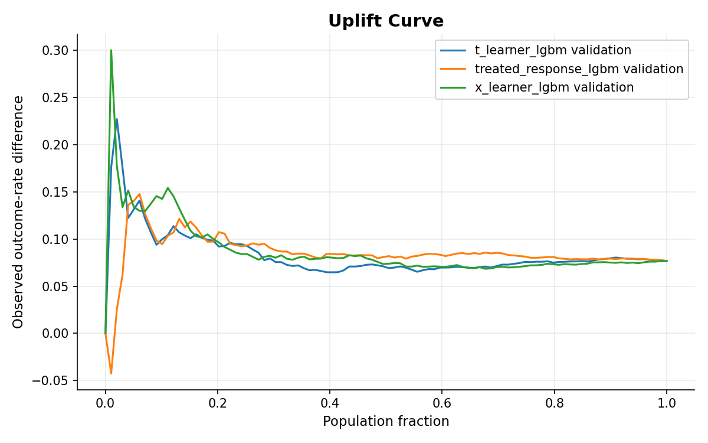
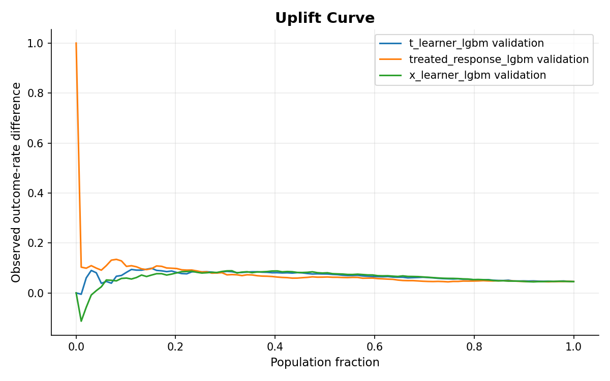
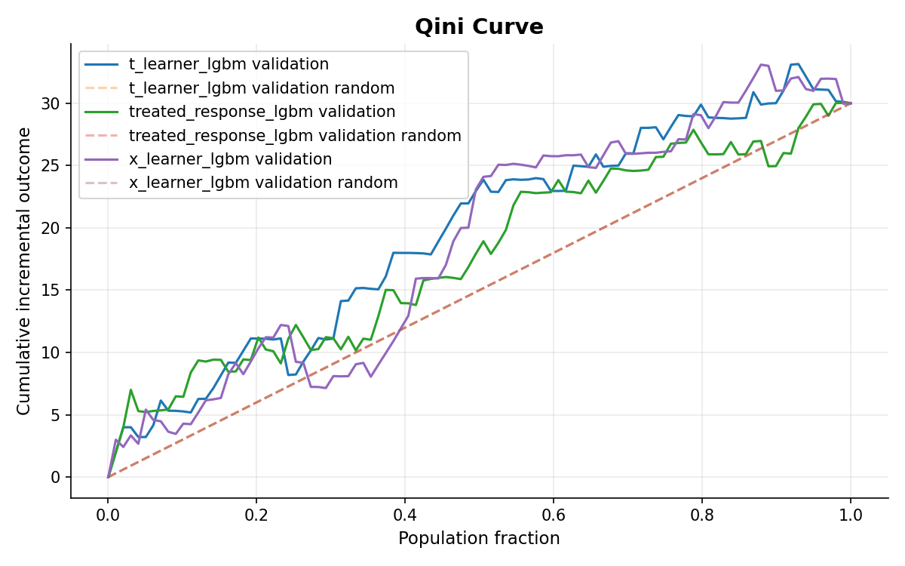
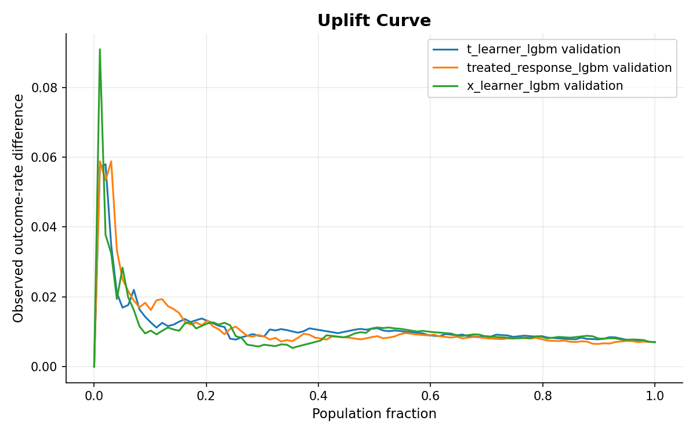
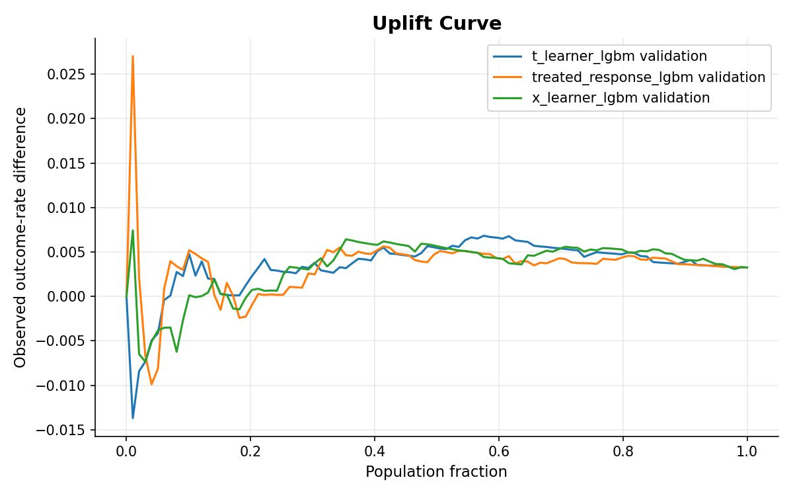

# Hillstrom Visit vs Conversion Results

## 1. Objective

The purpose of this report is to test whether uplift-based targeting can improve on a conventional Response Model in the Hillstrom campaign, and whether the result changes between the two outcomes:

- `visit`
- `conversion`

Hillstrom contains three campaign groups: `No E-Mail`, `Mens E-Mail`, and `Womens E-Mail`. Because the framework uses binary treatment, the analysis is run as two separate experiments:

- **Mens:** `No E-Mail = 0`, `Mens E-Mail = 1`
- **Womens:** `No E-Mail = 0`, `Womens E-Mail = 1`

Each experiment uses the same model set and the same **Top-20% primary targeting budget**:

| Model | Role |
|---|---|
| `treated_response_lgbm` | Response baseline |
| `t_learner_lgbm` | Uplift candidate |
| `x_learner_lgbm` | Uplift candidate |

The evaluation workflow is:

**Prepared data → train models → validation evaluation → Top-20% uplift selection → uplift champion → bootstrap replacement gate → locked-test evaluation**

Only T-Learner and X-Learner compete for the uplift-champion position. The selected uplift model is then compared with the Response baseline using paired bootstrap.

The Response baseline is replaced only when:

```text
ci_lower > 0
```

The deployment decision is fixed on validation before the locked test is opened.

---

## 2. Validation Data Sufficiency

The main difference between `visit` and `conversion` is the amount of positive-outcome information available for evaluation.

| Experiment | Outcome | Validation rows | Positive rate | Positive observations |
|---|---|---:|---:|---:|
| Mens | `visit` | 8,523 | 14.443% | 1,231 |
| Womens | `visit` | 8,539 | 12.880% | 1,100 |
| Mens | `conversion` | 8,523 | 0.915% | 78 |
| Womens | `conversion` | 8,539 | 0.726% | 62 |

`visit` has more than 1,100 positive observations in each validation set, while `conversion` has only 62–78.

Conversion therefore provides much less outcome signal at the Top-20% decision point, so small differences between policies should be interpreted more cautiously.

---

# 3. Visit Results

## 3.1 Validation Whole-Curve Results

### Mens Visit

| Model | AUUC | Qini |
|---|---:|---:|
| `t_learner_lgbm` | 159.916 | -3.531 |
| `treated_response_lgbm` | **175.328** | **11.881** |
| `x_learner_lgbm` | 161.625 | -1.822 |

The Response Model has the strongest whole-curve result for Mens Visit. Both uplift learners have negative Qini values, indicating weaker overall ranking performance than the Response baseline on this validation sample.




### Womens Visit

| Model | AUUC | Qini |
|---|---:|---:|
| `t_learner_lgbm` | 132.998 | 35.900 |
| `treated_response_lgbm` | 118.839 | 21.741 |
| `x_learner_lgbm` | **134.315** | **37.217** |

Womens Visit shows a different pattern. X-Learner has the strongest AUUC and Qini, while T-Learner is also above the Response Model.




The two campaigns therefore do not produce the same full-population ranking pattern: Response leads Mens Visit, while X-Learner leads Womens Visit.

However, whole-curve metrics are not used directly for model selection in this framework. The deployment decision is based on policy_value at the configured Top-20% targeting budget, so the next step is to compare the models at that operating point.

---

## 3.2 Visit Top-20% Policy Results

| Experiment | Model | Incremental visits | Policy value |
|---|---|---:|---:|
| Mens | `t_learner_lgbm` | 157.279 | 0.120149 |
| Mens | `treated_response_lgbm` | **177.874** | **0.123902** |
| Mens | `x_learner_lgbm` | 161.878 | 0.123434 |
| Womens | `t_learner_lgbm` | 142.914 | 0.122834 |
| Womens | `treated_response_lgbm` | **166.871** | 0.123486 |
| Womens | `x_learner_lgbm` | 136.673 | **0.123773** |

At the Top-20% decision point, X-Learner has a higher `policy_value` than T-Learner in both experiments.

Therefore:

**Visit uplift champion: `x_learner_lgbm` for both Mens and Womens.**

For Mens, the Response baseline still has the highest policy value overall. For Womens, X-Learner is only slightly above Response.

---

## 3.3 Visit Replacement Gate

| Experiment | Uplift champion | Mean Δ policy value vs Response | 95% CI | Gate | Recommended policy |
|---|---|---:|---:|---|---|
| Mens Visit | `x_learner_lgbm` | -0.000929 | [-0.008207, 0.005315] | Failed | `treated_response_lgbm` |
| Womens Visit | `x_learner_lgbm` | +0.000305 | [-0.007136, 0.008921] | Failed | `treated_response_lgbm` |

Both 95% CIs cross zero. For Mens Visit, the mean difference is slightly negative, while for Womens Visit it is slightly positive, but neither result is statistically strong enough to show that X-Learner consistently outperforms the Response Model. Therefore, the replacement gate fails for both campaigns and the Response Model remains the recommended policy.

**Recommended Visit policy: `treated_response_lgbm` for both Mens and Womens.**

---

## 3.4 Visit Locked-Test Results

The locked test evaluates the already-frozen X-Learner and Response policies on unseen data.

| Experiment | Policy | Top-20% incremental visits | Policy value | Test Qini |
|---|---|---:|---:|---:|
| Mens | `treated_response_lgbm` | **164.616** | **0.1234** | **5.816** |
| Mens | `x_learner_lgbm` | 148.790 | 0.1223 | 2.030 |
| Womens | `treated_response_lgbm` | **130.000** | 0.1214 | 13.304 |
| Womens | `x_learner_lgbm` | 116.927 | 0.1214 | **28.508** |

At the primary Top-20% budget, the Response Model produces more incremental visits than X-Learner in both campaigns.

Bootstrap results for the selected Response policies also remain fully above zero:

- **Mens:** mean ≈ 161.5, 95% CI ≈ **[104.5, 233.5]**
- **Womens:** mean ≈ 135.9, 95% CI ≈ **[84.5, 192.4]**

The locked-test results therefore support the validation decision to keep the Response Model for Visit. The selected policy continues to produce positive incremental visits on unseen data in both campaigns.

---

# 4. Conversion Results

## 4.1 Validation Whole-Curve Results

### Mens Conversion

| Model | AUUC | Qini |
|---|---:|---:|
| `t_learner_lgbm` | **19.446** | **4.449** |
| `treated_response_lgbm` | 17.786 | 2.788 |
| `x_learner_lgbm` | 18.657 | 3.660 |

T-Learner has the strongest whole-curve result for Mens Conversion, leading both AUUC and Qini. X-Learner ranks second, while the Response Model has the weakest full-curve result among the three policies.





### Womens Conversion

| Model | AUUC | Qini |
|---|---:|---:|
| `t_learner_lgbm` | **9.506** | **2.554** |
| `treated_response_lgbm` | 8.139 | 1.187 |
| `x_learner_lgbm` | 9.463 | 2.511 |

Womens Conversion shows the same overall pattern. T-Learner again has the highest AUUC and Qini, although X-Learner is very close on both metrics.




Unlike Visit, both Conversion campaigns produce the same full-curve leader: T-Learner.
---

## 4.2 Conversion Top-20% Policy Results

| Experiment | Model | Incremental conversions | Policy value |
|---|---|---:|---:|
| Mens | `t_learner_lgbm` | **22.607** | **0.008213** |
| Mens | `treated_response_lgbm` | 20.965 | 0.007978 |
| Mens | `x_learner_lgbm` | 21.361 | 0.007979 |
| Womens | `t_learner_lgbm` | **1.909** | **0.005861** |
| Womens | `treated_response_lgbm` | -3.775 | 0.005157 |
| Womens | `x_learner_lgbm` | 1.483 | 0.005859 |

T-Learner has the highest Top-20% `policy_value` among the uplift candidates in both experiments.

Therefore:

**Conversion uplift champion: `t_learner_lgbm` for both Mens and Womens.**

For Womens, T-Learner and X-Learner are nearly tied, showing very little separation between the two uplift candidates.

---

## 4.3 Conversion Replacement Gate

| Experiment | Uplift champion | Mean Δ policy value vs Response | 95% CI | Gate | Recommended policy |
|---|---|---:|---:|---|---|
| Mens Conversion | `t_learner_lgbm` | +0.000331 | [-0.000836, 0.001532] | Failed | `treated_response_lgbm` |
| Womens Conversion | `t_learner_lgbm` | +0.000677 | [-0.000355, 0.001647] | Failed | `treated_response_lgbm` |

Both confidence intervals cross zero.

T-Learner therefore does not show enough evidence to replace the Response baseline in either campaign.

**Recommended Conversion policy: `treated_response_lgbm` for both Mens and Womens.**

---

## 4.4 Conversion Locked-Test Results

The locked test compares the frozen T-Learner champion with the Response baseline.

| Experiment | Policy | Top-20% incremental conversions | Policy value | Test Qini |
|---|---|---:|---:|---:|
| Mens | `treated_response_lgbm` | **11.642** | **0.007274** | **0.733** |
| Mens | `t_learner_lgbm` | 4.823 | 0.006336 | -1.672 |
| Womens | `treated_response_lgbm` | **13.117** | **0.007498** | 3.018 |
| Womens | `t_learner_lgbm` | 6.921 | 0.006796 | **3.196** |

The Response Model produces more incremental conversions than T-Learner in both campaigns. Given the small number of conversion events, these point estimates should be interpreted cautiously.

Overall, the locked-test results remain consistent with the validation decision to keep the Response Model for Conversion.

---

# 5. Visit vs Conversion

The same framework produces different uplift champions but the same deployment decision.

| Comparison | Visit | Conversion |
|---|---|---|
| Validation positive observations | 1,100–1,231 | 62–78 |
| Uplift champion | X-Learner | T-Learner |
| Replacement gate | Failed in both campaigns | Failed in both campaigns |
| Recommended policy | Response Model | Response Model |
| Locked-test Top-20% result | Response produces more incremental visits than X-Learner in both campaigns | Response produces more incremental conversions than T-Learner in both campaigns |

The main difference is the amount of outcome evidence available. Visit has substantially more positive observations, while Conversion is much rarer.

However, the deployment conclusion is the same: none of the four uplift experiments provides enough validation evidence to replace the Response baseline.

---

# 6. Conclusion

After Criteo, Hillstrom provides a second test of the same uplift-selection framework under different data conditions. The two benchmarks are not directly comparable by raw AUUC, Qini, or policy_value: Criteo uses a Top-5% operating budget with an approximately 85/15 Treatment-Control split, while Hillstrom uses a dataset-specific modeling config, a Top-20% budget, and nearly balanced binary Treatment-Control experiments.

The result is also different. In Criteo, uplift modeling provides enough evidence to replace the Response Model for visit, while the Response Model is retained for conversion. In Hillstrom, neither X-Learner for visit nor T-Learner for conversion passes the replacement gate, so the Response Model remains the recommended policy across both campaigns and outcomes.

The contrast with Criteo shows that the uplift advantage does not automatically carry over to another dataset. Because the two benchmarks differ in scale, treatment distribution, outcome frequency, feature structure, modeling configuration, and targeting budget, the current experiments cannot yet determine which data characteristic is responsible for the different result.

The next step is to test the framework on additional datasets with different scales and data characteristics. Comparing the results across datasets can help identify which data conditions are more suitable for uplift modeling and when it provides a meaningful advantage over conventional Response targeting.

