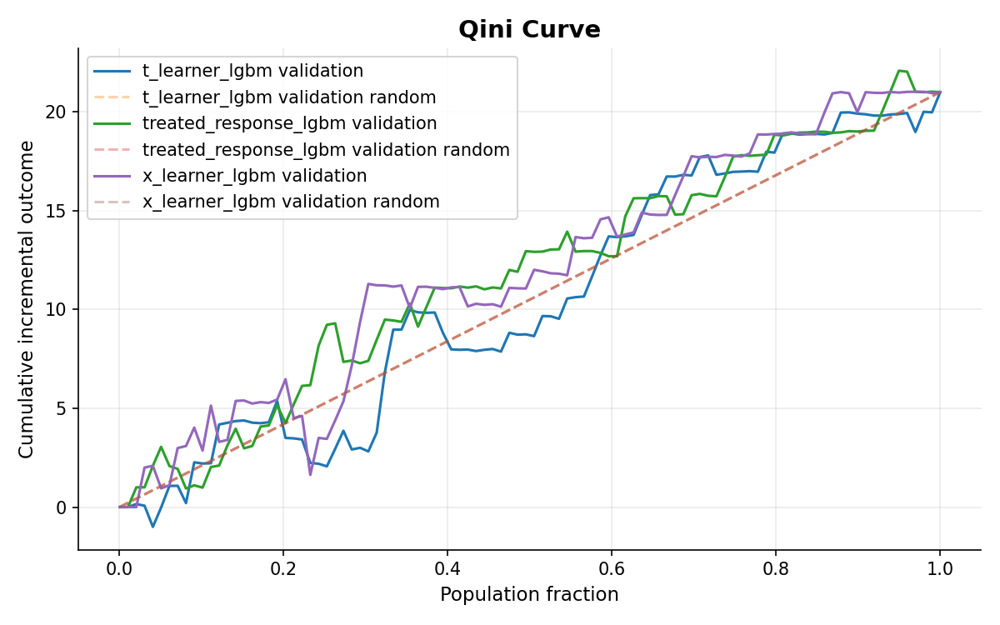
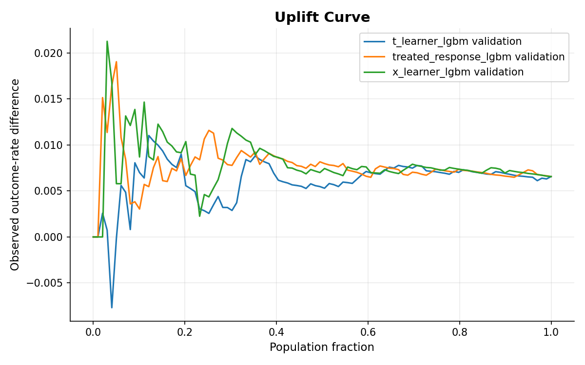
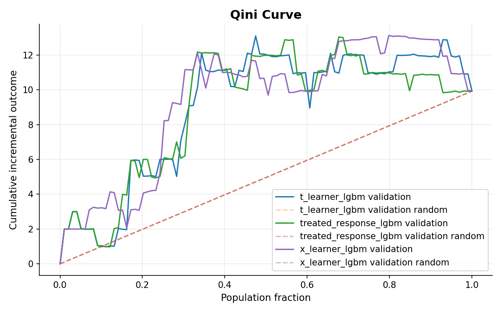
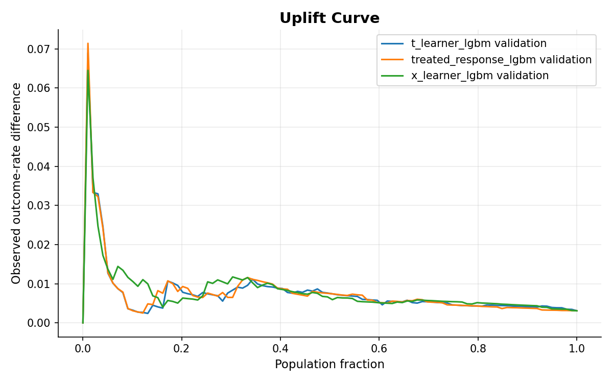
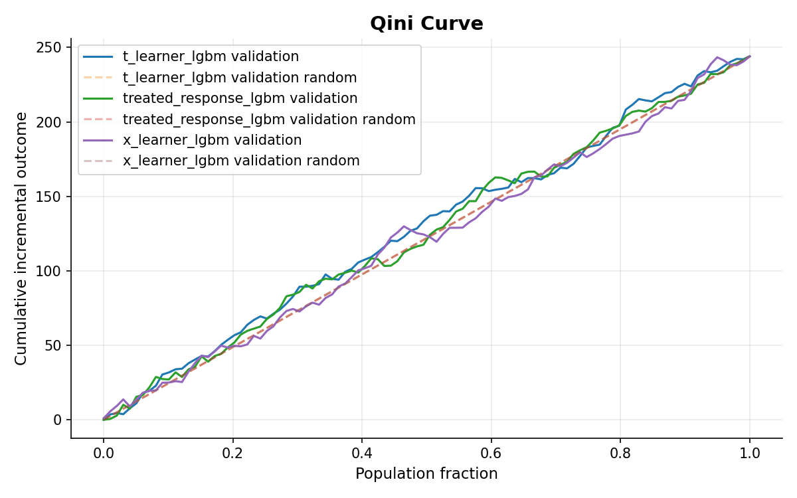
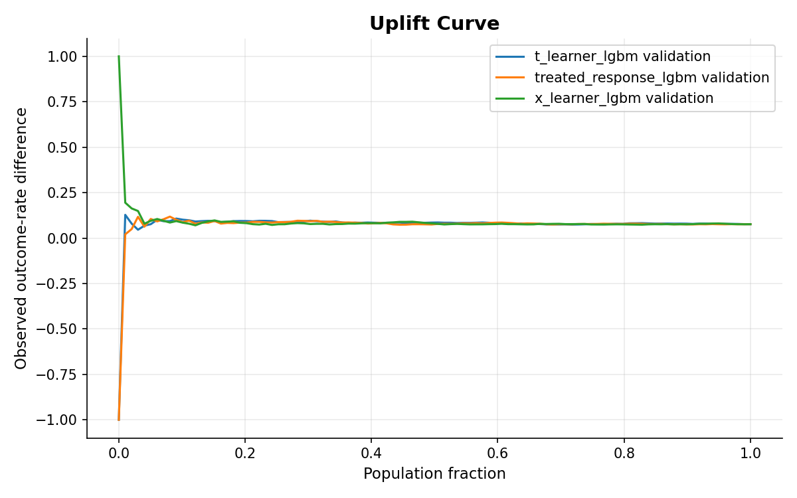
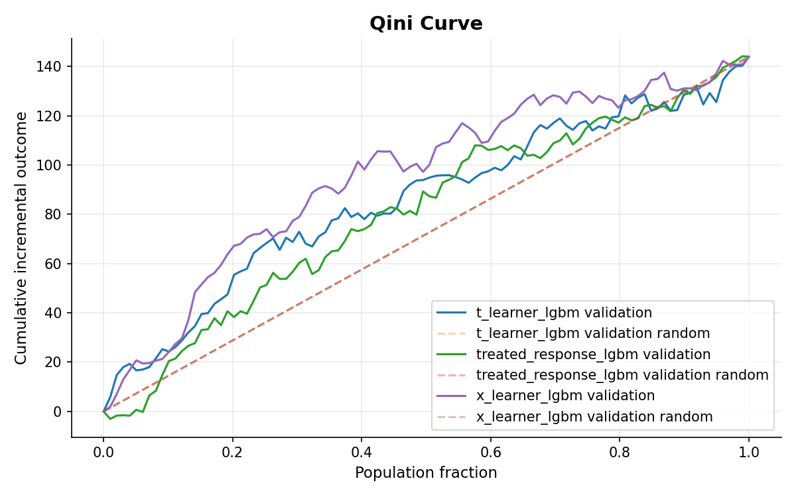
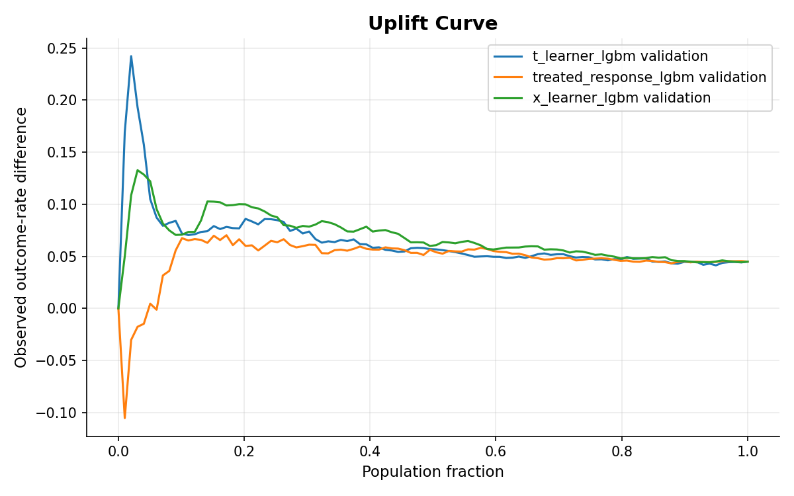

# Hillstrom Framework Evaluation

## 1. Objective

Hillstrom được dùng như một dataset mới để **kiểm tra khả năng áp dụng lại uplift modeling framework** ngoài Criteo.

Mục tiêu của lần train này không phải tối ưu model hay tìm cách tăng performance. Phần cần kiểm tra là framework có giữ được cùng workflow khi chuyển sang Hillstrom và các bước đánh giá có hoạt động đúng theo rule đã định trước hay không.

Cả run `003` và run `004` dùng cùng framework, cùng model set, cùng modeling config, cùng Top-20 rule, cùng bootstrap gate và cùng locked-test workflow. Điểm thay đổi là tỷ lệ chia train / validation / test:

- Run `003`: `70% / 15% / 15%`
- Run `004`: `60% / 20% / 20%`

Báo cáo tập trung vào ba câu hỏi:

1. Framework có chạy được end-to-end trên Hillstrom với cùng workflow train → validation → selection → replacement gate → locked test hay không?
2. Các bước đánh giá và decision rule của framework cho ra kết quả như thế nào trên Hillstrom?
3. Khi chỉ thay tỷ lệ split, kết quả trung gian và quyết định cuối cùng thay đổi đến đâu?

Qini, AUUC, Top-20 policy value và bootstrap được dùng để **kiểm tra evaluation và decision logic của framework**, không phải để model tuning.

---

## 2. Experimental design

### Framework và modeling setup

Cả run `003` và run `004` sử dụng **cùng framework và cùng modeling configuration**:

```yaml
training:
  prediction_batch_size: 10000
  early_stopping_rounds: 50

models:
  model_defaults:
    objective: binary
    boosting_type: gbdt
    n_estimators: 2000
    learning_rate: 0.03
    num_leaves: 31
    max_depth: 6
    min_child_samples: 200
    subsample: 0.8
    subsample_freq: 1
    colsample_bytree: 0.8
    reg_alpha: 0.1
    reg_lambda: 1.0
    random_state: 42

selection:
  primary_split: validation
  primary_budget_fraction: 0.20
  primary_metric: policy_value
```

Ba model được train cho từng outcome:

| Model | Vai trò |
|---|---|
| `treated_response_lgbm` | Response baseline |
| `t_learner_lgbm` | Uplift candidate |
| `x_learner_lgbm` | Uplift candidate |

Workflow được giữ nguyên:

**Prepared data → train models → validation evaluation → Top-20 selection → uplift champion → bootstrap replacement gate → locked-test evaluation**

Uplift champion chỉ được chọn giữa T-Learner và X-Learner, Response Model được giữ riêng làm baseline. Nếu uplift champion không vượt qua bootstrap replacement gate tại Top 20%, framework fallback về Response Model.

### Data split

| Run | Split | `hillstrom_mens` train / validation / test | `hillstrom_womens` train / validation / test |
|---|---|---:|---:|
| `003` | 70% / 15% / 15% | 29,829 / 6,392 / 6,392 | 29,885 / 6,404 / 6,404 |
| `004` | 60% / 20% / 20% | 25,567 / 8,523 / 8,523 | 25,615 / 8,539 / 8,539 |

Primary selection budget vẫn là **20%** trong cả hai run. Top 20% tương ứng khoảng **1.28k khách hàng ở run `003`** và khoảng **1.71k khách hàng ở run `004`** cho mỗi experiment.

---

## 3. Data sufficiency

### Validation sample

| Run | Experiment | Outcome | Validation rows | Positive rate | Số mẫu `outcome = 1` |
|---|---|---|---:|---:|---:|
| `003` | Mens | `conversion` | 6,392 | 0.923% | 59 |
| `003` | Womens | `conversion` | 6,404 | 0.750% | 48 |
| `003` | Mens | `visit` | 6,392 | 14.456% | 924 |
| `003` | Womens | `visit` | 6,404 | 12.883% | 825 |
| `004` | Mens | `conversion` | 8,523 | 0.915% | 78 |
| `004` | Womens | `conversion` | 8,539 | 0.726% | 62 |
| `004` | Mens | `visit` | 8,523 | 14.443% | 1,231 |
| `004` | Womens | `visit` | 8,539 | 12.880% | 1,100 |

Khác biệt rõ nhất nằm ở số positive sample. `visit` có từ **825 đến 1,231** positive observations trên validation, trong khi `conversion` chỉ có từ **48 đến 78**.

Vì vậy, `conversion` dễ dao động hơn khi evaluation chỉ nhìn vào một nhóm Top-k. Điều này cũng thể hiện trên uplift curves: phần đầu curve của `conversion` biến động mạnh hơn, đặc biệt ở population fraction nhỏ. Những spike đầu curve nên được xem là estimate chưa ổn định do số treated/control observations và positive outcomes trong prefix còn ít.

---

## 4. Validation ranking across splits

Qini và AUUC được dùng để xem model ranking hoạt động thế nào trên **toàn bộ population curve**. Đây là metric để phân tích ranking behavior, không phải rule cuối cùng để quyết định deployment.

### Whole-curve winner

| Experiment | Outcome | Run `003` | Run `004` | Nhận xét |
|---|---|---|---|---|
| Mens | `conversion` | X-Learner | T-Learner | Winner đổi khi thay split |
| Womens | `conversion` | X-Learner | T-Learner | Winner đổi khi thay split |
| Mens | `visit` | T-Learner | Response Model | Winner đổi khi thay split |
| Womens | `visit` | X-Learner | X-Learner | Winner giữ nguyên |

Ba trong bốn experiment–outcome đổi whole-curve winner khi thay split.

- **Mens conversion:** X-Learner đứng đầu ở run `003`, T-Learner đứng đầu ở run `004`.
- **Womens conversion:** X-Learner đứng đầu ở run `003`; sang run `004`, T-Learner nhỉnh hơn.
- **Mens visit:** T-Learner đứng đầu ở run `003`; sang run `004`, Response Model đứng đầu và Qini của hai uplift learners đều âm.
- **Womens visit:** X-Learner đứng đầu ở cả hai run, nên đây là trường hợp whole-curve ranking ổn định nhất giữa hai split.

Kết quả này cho thấy Qini/AUUC winner có thể thay đổi theo split. Vì vậy, framework không dùng whole-curve winner làm quyết định deployment mà tiếp tục đánh giá tại Top 20% và qua replacement gate.

---

## 5. Top-20 selection & replacement gate

Cả hai run sử dụng cùng mức ngân sách **Top 20%** và cùng replacement logic. T-Learner và X-Learner được so sánh theo `policy_value` để chọn uplift champion; champion sau đó được so với Response baseline bằng paired bootstrap.

Điều kiện thay baseline:

```text
ci_lower > 0
```

### Run `003`

| Experiment | Outcome      | Model                   | Incremental outcome | Policy value |
| ---------- | ------------ | ----------------------- | ------------------: | -----------: |
| Mens       | `conversion` | `t_learner_lgbm`        |               7.088 |     0.006884 |
| Mens       | `conversion` | `treated_response_lgbm` |               8.659 |     0.007196 |
| Mens       | `conversion` | `x_learner_lgbm`        |          **13.360** | **0.007822** |
| Womens     | `conversion` | `t_learner_lgbm`        |              10.023 | **0.007498** |
| Womens     | `conversion` | `treated_response_lgbm` |          **10.102** |     0.007499 |
| Womens     | `conversion` | `x_learner_lgbm`        |               8.169 |     0.007187 |
| Mens       | `visit`      | `t_learner_lgbm`        |         **119.185** | **0.120463** |
| Mens       | `visit`      | `treated_response_lgbm` |             108.031 |     0.117960 |
| Mens       | `visit`      | `x_learner_lgbm`        |             104.368 |     0.117647 |
| Womens     | `visit`      | `t_learner_lgbm`        |             110.792 |     0.123444 |
| Womens     | `visit`      | `treated_response_lgbm` |              76.835 |     0.117155 |
| Womens     | `visit`      | `x_learner_lgbm`        |         **128.777** | **0.128132** |

Tại Top 20%, Mens `conversion` chọn X-Learner, Womens `conversion` chọn T-Learner, Mens `visit` chọn T-Learner và Womens `visit` chọn X-Learner làm uplift champion.

| Experiment | Outcome      | Uplift champion  | Champion policy value | Response policy value | Mean Δ policy value | 95% CI                | Gate   | Deployment              |
| ---------- | ------------ | ---------------- | --------------------: | --------------------: | ------------------: | --------------------- | ------ | ----------------------- |
| Mens       | `conversion` | `x_learner_lgbm` |              0.007822 |              0.007196 |           +0.000142 | [-0.001419, 0.001559] | Failed | `treated_response_lgbm` |
| Womens     | `conversion` | `t_learner_lgbm` |              0.007498 |              0.007499 |           -0.000013 | [-0.000633, 0.000926] | Failed | `treated_response_lgbm` |
| Mens       | `visit`      | `t_learner_lgbm` |              0.120463 |              0.117960 |           +0.002677 | [-0.005861, 0.010290] | Failed | `treated_response_lgbm` |
| Womens     | `visit`      | `x_learner_lgbm` |              0.128132 |              0.117155 |           +0.009522 | [-0.000201, 0.019971] | Failed | `treated_response_lgbm` |

Một số uplift champion có `policy_value` cao hơn Response baseline, đặc biệt ở Womens `visit`. Tuy nhiên, 95% CI của phần chênh lệch vẫn chứa 0 ở cả bốn trường hợp. Vì vậy, chưa có uplift champion nào vượt qua replacement gate và Response Model tiếp tục được giữ lại.

### Run `004`

| Experiment | Outcome      | Model                   | Incremental outcome | Policy value |
| ---------- | ------------ | ----------------------- | ------------------: | -----------: |
| Mens       | `conversion` | `t_learner_lgbm`        |          **22.607** | **0.008213** |
| Mens       | `conversion` | `treated_response_lgbm` |              20.965 |     0.007978 |
| Mens       | `conversion` | `x_learner_lgbm`        |              21.361 |     0.007979 |
| Womens     | `conversion` | `t_learner_lgbm`        |           **1.909** | **0.005861** |
| Womens     | `conversion` | `treated_response_lgbm` |              -3.775 |     0.005157 |
| Womens     | `conversion` | `x_learner_lgbm`        |               1.483 |     0.005859 |
| Mens       | `visit`      | `t_learner_lgbm`        |             157.279 |     0.120149 |
| Mens       | `visit`      | `treated_response_lgbm` |         **177.874** |     0.123902 |
| Mens       | `visit`      | `x_learner_lgbm`        |             161.878 | **0.123434** |
| Womens     | `visit`      | `t_learner_lgbm`        |             142.914 |     0.122834 |
| Womens     | `visit`      | `treated_response_lgbm` |         **166.871** |     0.123486 |
| Womens     | `visit`      | `x_learner_lgbm`        |             136.673 | **0.123773** |

Ở run `004`, T-Learner được chọn làm uplift champion cho cả Mens và Womens `conversion`, trong khi X-Learner được chọn cho cả hai `visit` experiment.

Với Mens `visit`, Response Model có `policy_value` cao nhất trong ba model, nhưng uplift champion vẫn là X-Learner vì bước champion selection chỉ so sánh hai uplift candidates. Womens `visit` cũng chọn X-Learner vì model này có `policy_value` cao hơn T-Learner, dù Response Model có incremental outcome cao hơn.

| Experiment | Outcome      | Uplift champion  | Champion policy value | Response policy value | Mean Δ policy value | 95% CI                | Gate   | Deployment              |
| ---------- | ------------ | ---------------- | --------------------: | --------------------: | ------------------: | --------------------- | ------ | ----------------------- |
| Mens       | `conversion` | `t_learner_lgbm` |              0.008213 |              0.007978 |           +0.000331 | [-0.000836, 0.001532] | Failed | `treated_response_lgbm` |
| Womens     | `conversion` | `t_learner_lgbm` |              0.005861 |              0.005157 |           +0.000677 | [-0.000355, 0.001647] | Failed | `treated_response_lgbm` |
| Mens       | `visit`      | `x_learner_lgbm` |              0.123434 |              0.123902 |           -0.000929 | [-0.008207, 0.005315] | Failed | `treated_response_lgbm` |
| Womens     | `visit`      | `x_learner_lgbm` |              0.123773 |              0.123486 |           +0.000305 | [-0.007136, 0.008921] | Failed | `treated_response_lgbm` |

Tương tự run `003`, không trường hợp nào có 95% CI của phần chênh lệch nằm hoàn toàn trên 0. Vì vậy, cả bốn replacement gate đều failed và Response Model tiếp tục được giữ lại.

Nhìn chung, uplift champion có thay đổi giữa hai split ở một số experiment, nhưng quyết định cuối cùng không đổi: chưa có uplift model nào chứng minh được mức cải thiện đủ ổn định tại Top 20% để thay Response baseline.


---

## 7. Split sensitivity

Vì framework và evaluation logic được giữ nguyên, phần này chỉ xem xét tác động của việc thay tỷ lệ split.

| Experiment | Outcome | Whole-curve winner `003` | Whole-curve winner `004` | Uplift champion `003` | Uplift champion `004` | Deployment `003` | Deployment `004` |
|---|---|---|---|---|---|---|---|
| Mens | `conversion` | X-Learner | T-Learner | X-Learner | T-Learner | Response Model | Response Model |
| Womens | `conversion` | X-Learner | T-Learner | T-Learner | T-Learner | Response Model | Response Model |
| Mens | `visit` | T-Learner | Response Model | T-Learner | X-Learner | Response Model | Response Model |
| Womens | `visit` | X-Learner | X-Learner | X-Learner | X-Learner | Response Model | Response Model |

Có ba pattern chính:

- **Whole-curve ranking nhạy với split:** 3/4 experiment–outcome đổi winner.
- **Uplift champion ổn định hơn ở Womens:** Womens conversion vẫn chọn T-Learner ở cả hai run; Womens visit vẫn chọn X-Learner ở cả hai run. Với Mens, champion đổi ở cả conversion và visit.
- **Deployment decision không đổi:** tất cả replacement gate đều failed, nên Response Model được giữ trong cả hai split.

### Locked-test stability của Response policy

| Experiment | Outcome | Run `003` — 95% CI | Run `004` — 95% CI | Nhận xét |
|---|---|---:|---:|---|
| Mens | `conversion` | **[5.095, 29.629]** | [-1.274, 27.925] | Kết quả thay đổi theo split |
| Womens | `conversion` | [-10.708, 14.990] | [-2.705, 29.989] | Cả hai run đều chưa loại trừ 0 |
| Mens | `visit` | **[78.872, 184.539]** | **[104.522, 233.457]** | Incremental visit dương ở cả hai split |
| Womens | `visit` | **[77.056, 189.841]** | **[84.528, 192.438]** | Incremental visit dương ở cả hai split |

Như vậy, đổi split làm thay đổi khá nhiều **winner trung gian**, nhưng không làm thay đổi **replacement decision**. `visit` cũng giữ pattern ổn định hơn `conversion` trên locked test.

---

## 8. Limitations

### Rare conversion outcome

`conversion` chỉ có từ 48 đến 78 positive observations trên validation, trong khi `visit` có từ 825 đến 1,231. Vì vậy, conversion metrics và Top-k estimates dễ dao động hơn.

### Split dependence

Hai run thay đổi cả train size lẫn validation/test size. Vì vậy, thay đổi kết quả giữa `003` và `004` phản ánh sensitivity với toàn bộ cách chia dữ liệu, không chỉ riêng việc validation lớn hơn.

### Same source dataset

Cả hai run đều dùng Hillstrom. Đây là split-sensitivity analysis trên cùng một dataset, không phải hai independent experiments.

### Early-curve instability

Các điểm đầu của uplift curve, đặc biệt ở `conversion`, có thể dao động mạnh do sample trong prefix còn nhỏ. Không nên diễn giải các spike này như treatment effect ổn định.

---

## 9. Conclusion

1. **Framework chạy đầy đủ trên Hillstrom ở cả Mens/Womens và cả hai split.**  
   Cùng workflow train → validation evaluation → Top-20 selection → uplift champion → replacement gate → locked test được giữ nguyên cho cả `conversion` và `visit`.

2. **Decision rule hoạt động nhất quán.**  
   Uplift champion được chọn giữa T-Learner và X-Learner theo `policy_value`, sau đó mới so với Response baseline. Không champion nào vượt replacement gate ở cả run `003` và `004`, nên Response Model được giữ cho deployment.

3. **Kết quả trung gian nhạy với split, nhưng quyết định cuối cùng không đổi.**  
   Whole-curve winner đổi ở 3/4 experiment–outcome. Uplift champion của Mens cũng đổi giữa hai split, trong khi Womens giữ cùng champion cho cả hai outcome. Dù vậy, deployment recommendation vẫn là Response Model trong tất cả trường hợp.

4. **`visit` cho kết quả ổn định hơn `conversion`.**  
   Trên locked test, Mens và Womens `visit` đều có bootstrap CI của incremental outcome hoàn toàn lớn hơn 0 ở cả hai split. `conversion` có ít positive observations hơn và confidence interval kém ổn định hơn.

Tóm lại, Hillstrom cho thấy framework có thể được áp dụng lại trên một dataset khác với cùng workflow và cùng decision logic. Run `003` và run `004` không phải hai cách modeling khác nhau; chúng chỉ thay tỷ lệ split để kiểm tra độ nhạy. Kết quả chính của giai đoạn này là **xác nhận framework chạy end-to-end và giữ được decision logic nhất quán**, không phải tối ưu model performance.

---

# Appendix

## A. Response Model diagnostics

| Run | Experiment | Outcome | ROC-AUC | Average Precision |
|---|---|---|---:|---:|
| `003` | Mens | `conversion` | 0.631 | 0.0145 |
| `003` | Womens | `conversion` | 0.600 | 0.0107 |
| `003` | Mens | `visit` | 0.632 | 0.2190 |
| `003` | Womens | `visit` | 0.620 | 0.1801 |
| `004` | Mens | `conversion` | 0.580 | 0.0145 |
| `004` | Womens | `conversion` | 0.592 | 0.0099 |
| `004` | Mens | `visit` | 0.628 | 0.2093 |
| `004` | Womens | `visit` | 0.621 | 0.1825 |

Các chỉ số này chỉ dùng để kiểm tra Response Model có học được tín hiệu outcome hay không. Chúng không tham gia replacement decision.

---

## B. Validation whole-curve metrics

### Run `003`

#### Mens — Conversion

| Model | AUUC | Qini |
|---|---:|---:|
| `t_learner_lgbm` | 10.568 | 0.068 |
| `treated_response_lgbm` | 11.773 | 1.273 |
| `x_learner_lgbm` | **11.993** | **1.493** |

#### Womens — Conversion

| Model | AUUC | Qini |
|---|---:|---:|
| `t_learner_lgbm` | 9.049 | 4.085 |
| `treated_response_lgbm` | 8.896 | 3.932 |
| `x_learner_lgbm` | **9.355** | **4.391** |

#### Mens — Visit

| Model | AUUC | Qini |
|---|---:|---:|
| `t_learner_lgbm` | **128.038** | **6.038** |
| `treated_response_lgbm` | 125.490 | 3.490 |
| `x_learner_lgbm` | 122.097 | 0.097 |

#### Womens — Visit

| Model | AUUC | Qini |
|---|---:|---:|
| `t_learner_lgbm` | 85.608 | 13.640 |
| `treated_response_lgbm` | 80.685 | 8.717 |
| `x_learner_lgbm` | **95.291** | **23.323** |

### Run `004`

#### Mens — Conversion

| Model | AUUC | Qini |
|---|---:|---:|
| `t_learner_lgbm` | **19.446** | **4.449** |
| `treated_response_lgbm` | 17.786 | 2.788 |
| `x_learner_lgbm` | 18.657 | 3.660 |

#### Womens — Conversion

| Model | AUUC | Qini |
|---|---:|---:|
| `t_learner_lgbm` | **9.506** | **2.554** |
| `treated_response_lgbm` | 8.139 | 1.187 |
| `x_learner_lgbm` | 9.463 | 2.511 |

#### Mens — Visit

| Model | AUUC | Qini |
|---|---:|---:|
| `t_learner_lgbm` | 159.916 | -3.531 |
| `treated_response_lgbm` | **175.328** | **11.881** |
| `x_learner_lgbm` | 161.625 | -1.822 |

#### Womens — Visit

| Model | AUUC | Qini |
|---|---:|---:|
| `t_learner_lgbm` | 132.998 | 35.900 |
| `treated_response_lgbm` | 118.839 | 21.741 |
| `x_learner_lgbm` | **134.315** | **37.217** |

---

## C. Run `003` detailed Top-20 metrics

| Experiment | Outcome | Model | Incremental outcome | Policy value |
|---|---|---|---:|---:|
| Mens | `conversion` | `t_learner_lgbm` | 7.088 | 0.006884 |
| Mens | `conversion` | `treated_response_lgbm` | 8.659 | 0.007196 |
| Mens | `conversion` | `x_learner_lgbm` | **13.360** | **0.007822** |
| Womens | `conversion` | `t_learner_lgbm` | 10.023 | 0.007498 |
| Womens | `conversion` | `treated_response_lgbm` | **10.102** | **0.007499** |
| Womens | `conversion` | `x_learner_lgbm` | 8.169 | 0.007187 |
| Mens | `visit` | `t_learner_lgbm` | **119.185** | **0.120463** |
| Mens | `visit` | `treated_response_lgbm` | 108.031 | 0.117960 |
| Mens | `visit` | `x_learner_lgbm` | 104.368 | 0.117647 |
| Womens | `visit` | `t_learner_lgbm` | 110.792 | 0.123444 |
| Womens | `visit` | `treated_response_lgbm` | 76.835 | 0.117155 |
| Womens | `visit` | `x_learner_lgbm` | **128.777** | **0.128132** |

---

## D. Run `004` validation details

### Top-20 metrics

| Experiment | Outcome | Model | Incremental outcome | Policy value |
|---|---|---|---:|---:|
| Mens | `conversion` | `t_learner_lgbm` | **22.607** | **0.008213** |
| Mens | `conversion` | `treated_response_lgbm` | 20.965 | 0.007978 |
| Mens | `conversion` | `x_learner_lgbm` | 21.361 | 0.007979 |
| Womens | `conversion` | `t_learner_lgbm` | **1.909** | **0.005861** |
| Womens | `conversion` | `treated_response_lgbm` | -3.775 | 0.005157 |
| Womens | `conversion` | `x_learner_lgbm` | 1.483 | 0.005859 |
| Mens | `visit` | `t_learner_lgbm` | 157.279 | 0.120149 |
| Mens | `visit` | `treated_response_lgbm` | **177.874** | **0.123902** |
| Mens | `visit` | `x_learner_lgbm` | 161.878 | 0.123434 |
| Womens | `visit` | `t_learner_lgbm` | 142.914 | 0.122834 |
| Womens | `visit` | `treated_response_lgbm` | **166.871** | 0.123486 |
| Womens | `visit` | `x_learner_lgbm` | 136.673 | **0.123773** |

### Uplift champion and gate

| Experiment | Outcome | Uplift champion | Mean Δ policy value | 95% CI | Gate | Deployment |
|---|---|---|---:|---:|---|---|
| Mens | `conversion` | `t_learner_lgbm` | +0.000331 | [-0.000836, 0.001532] | Failed | `treated_response_lgbm` |
| Womens | `conversion` | `t_learner_lgbm` | +0.000677 | [-0.000355, 0.001647] | Failed | `treated_response_lgbm` |
| Mens | `visit` | `x_learner_lgbm` | -0.000929 | [-0.008207, 0.005315] | Failed | `treated_response_lgbm` |
| Womens | `visit` | `x_learner_lgbm` | +0.000305 | [-0.007136, 0.008921] | Failed | `treated_response_lgbm` |

---

## E. Run `003` locked-test details

### Whole-curve metrics

| Experiment | Outcome | Policy | AUUC | Qini | Policy value |
|---|---|---|---:|---:|---:|
| Mens | `conversion` | `treated_response_lgbm` | 14.555 | 3.555 | 0.007822 |
| Mens | `conversion` | `x_learner_lgbm` | 14.491 | 3.491 | 0.008761 |
| Womens | `conversion` | `treated_response_lgbm` | 6.058 | 1.092 | 0.006555 |
| Womens | `conversion` | `t_learner_lgbm` | 6.023 | 1.056 | 0.006868 |
| Mens | `visit` | `treated_response_lgbm` | 129.663 | 7.163 | 0.133917 |
| Mens | `visit` | `t_learner_lgbm` | 121.213 | -1.287 | 0.128285 |
| Womens | `visit` | `treated_response_lgbm` | 90.578 | 17.821 | 0.130834 |
| Womens | `visit` | `x_learner_lgbm` | 105.092 | 32.335 | 0.131539 |

### Top-20 policy metrics

| Experiment | Outcome | Policy | Incremental outcome | Bootstrap mean | 95% CI |
|---|---|---|---:|---:|---:|
| Mens | `conversion` | `treated_response_lgbm` | 18.102 | 16.938 | **[5.095, 29.629]** |
| Mens | `conversion` | `x_learner_lgbm` | 18.070 | 16.673 | **[3.363, 31.186]** |
| Womens | `conversion` | `treated_response_lgbm` | 1.366 | 1.109 | [-10.708, 14.990] |
| Womens | `conversion` | `t_learner_lgbm` | 1.571 | 1.853 | [-10.404, 11.695] |
| Mens | `visit` | `treated_response_lgbm` | 139.413 | 135.773 | **[78.872, 184.539]** |
| Mens | `visit` | `t_learner_lgbm` | 110.351 | 110.751 | **[55.314, 166.792]** |
| Womens | `visit` | `treated_response_lgbm` | 131.083 | 127.189 | **[77.056, 189.841]** |
| Womens | `visit` | `x_learner_lgbm` | 113.860 | 111.419 | **[71.292, 160.416]** |

---

## F. Run `004` locked-test details

### Response policy

| Experiment | Outcome | Policy | Test Qini | Top-20% incremental outcome | Bootstrap mean | 95% CI |
|---|---|---|---:|---:|---:|---:|
| Mens | `conversion` | `treated_response_lgbm` | 0.733 | 11.642 | 12.171 | [-1.274, 27.925] |
| Womens | `conversion` | `treated_response_lgbm` | 3.018 | 13.117 | 12.906 | [-2.705, 29.989] |
| Mens | `visit` | `treated_response_lgbm` | 5.816 | 164.616 | 161.490 | **[104.522, 233.457]** |
| Womens | `visit` | `treated_response_lgbm` | 13.304 | 130.000 | 135.916 | **[84.528, 192.438]** |

### Paired contrast: uplift champion vs Response

| Experiment | Outcome | Uplift champion | Δ policy value | 95% CI | Δ incremental outcome | 95% CI |
|---|---|---|---:|---:|---:|---:|
| Mens | `conversion` | `t_learner_lgbm` | -0.001012 | [-0.003414, 0.001192] | -7.404 | [-27.257, 11.603] |
| Womens | `conversion` | `t_learner_lgbm` | -0.000647 | [-0.001865, 0.000468] | -5.786 | [-15.844, 3.788] |
| Mens | `visit` | `x_learner_lgbm` | -0.001399 | [-0.008008, 0.005749] | -13.809 | [-60.458, 39.074] |
| Womens | `visit` | `x_learner_lgbm` | -0.000333 | [-0.010477, 0.009390] | -17.750 | [-102.486, 49.126] |

---

## G. Figures

### Run `003` — Mens Conversion





### Run `003` — Womens Conversion





### Run `003` — Mens Visit





### Run `003` — Womens Visit





### Run `004` — Mens Conversion


### Run `004` — Womens Conversion


### Run `004` — Mens Visit


### Run `004` — Womens Visit


