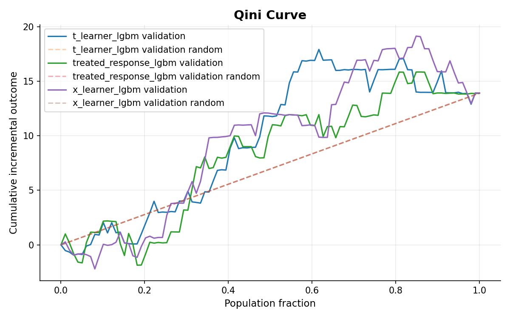
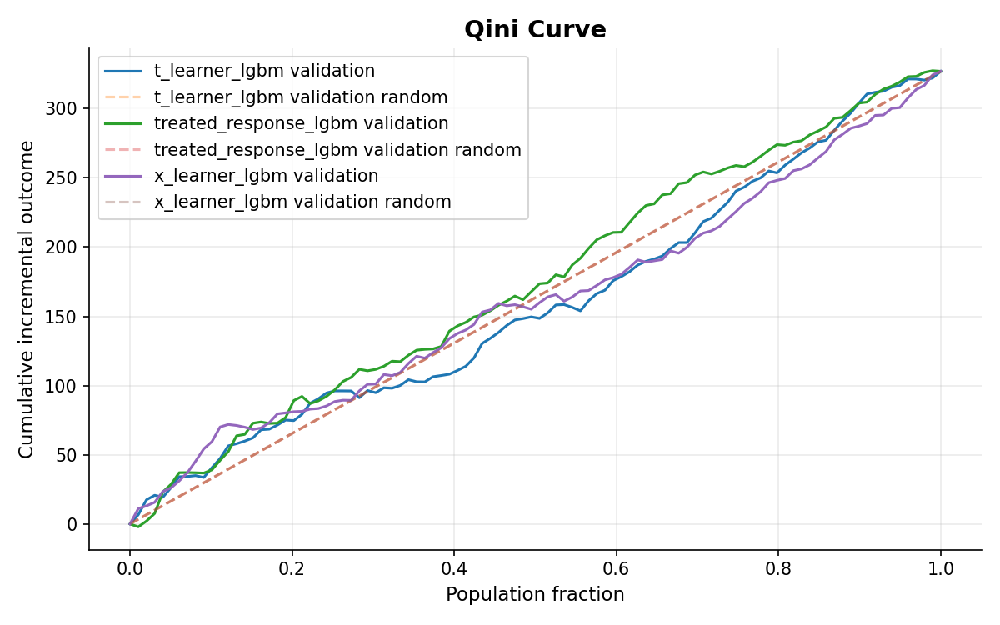
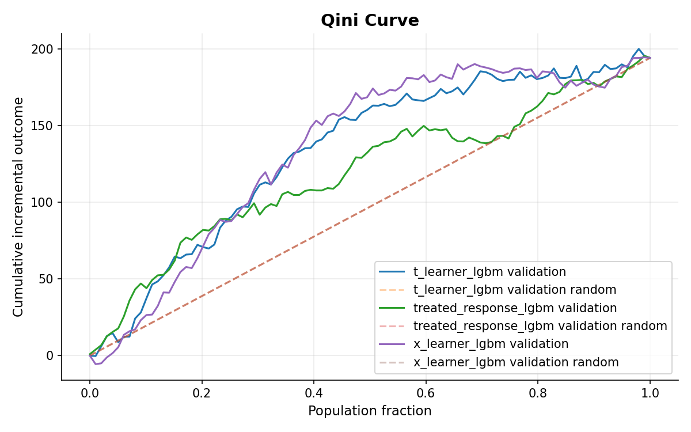

## Experiments — Hillstrom

### Dataset và tính phù hợp với framework

Dataset được sử dụng là **Hillstrom Email Marketing Dataset**, gồm **64,000 khách hàng** trong một randomized marketing experiment. Mỗi khách hàng được phân ngẫu nhiên vào một trong ba nhóm:

- `No E-Mail`: không nhận email, dùng làm control;
- `Mens E-Mail`: nhận email quảng bá sản phẩm nam;
- `Womens E-Mail`: nhận email quảng bá sản phẩm nữ.

Dữ liệu phù hợp với bài toán uplift vì có đầy đủ ba thành phần: **pre-treatment customer features, treatment assignment và post-treatment outcome**. 

- Ba experimental group gần như được chia đều;

    | Segment         | Customers | Percentage |
    |-----------------|-----------|------------|
    | Womens E-Mail   | 21,387    | 33.4172%   |
    | Mens E-Mail     | 21,307    | 33.2922%   |
    | No E-Mail       | 21,306    | 33.2906%   |

- Sample-ratio test không cho thấy allocation bất thường (`χ² = 0.203`, `p = 0.904`);
- Covariate balance tốt, maximum absolute SMD chỉ khoảng **0.014**;
- Các subgroup chính đều có observation ở các treatment arm;

    | Feature     | Zero Cells | Minimum Group Size |
    |-------------|------------|--------------------|
    | recency     | 0          | 767                |
    | history_segment | 0       | 416                |
    | mens        | 0          | 9,519              |
    | womens      | 0          | 9,558              |
    | newbie      | 0          | 10,611             |
    | zip_code    | 0          | 3,139              |
    | channel     | 0          | 2,577              |

- Customer characteristics được ghi nhận trước campaign, còn `visit` và `conversion` là outcome sau campaign.


Do framework hiện xử lý binary treatment, Hillstrom được tách thành hai experiment độc lập:

| Experiment | Control | Treatment | Prepared rows |
|---|---|---|---:|
| `hillstrom_mens` | `No E-Mail` | `Mens E-Mail` | 42,613 |
| `hillstrom_womens` | `No E-Mail` | `Womens E-Mail` | 42,693 |

Sau feature engineering, cả hai experiment dùng cùng **12 features** và treatment/control gần như 50/50. Hai outcome được train riêng là `visit` và `conversion`.

Mục tiêu của experiment là:

> Nếu chỉ target một phần khách hàng, policy nào chọn được nhóm tạo ra incremental outcome tốt và ổn định nhất?

---

### Data Understanding

Outcome trung bình khác nhau rõ giữa ba experimental group:


| Group | Visit rate | Conversion rate |
|---|---:|---:|
| `No E-Mail` | 10.62% | 0.57% |
| `Mens E-Mail` | 18.28% | 1.25% |
| `Womens E-Mail` | 15.14% | 0.88% |


Kết quả ban đầu cho thấy cả `Mens E-Mail` và `Womens E-Mail` đều **positive uplift** với nhóm `No E-Mail`. Nhìn chung, Mens E-Mail tạo uplift cao hơn Womens E-Mail, nhưng khoảng cách giữa hai campaign không cố định mà thay đổi theo đặc điểm của từng nhóm khách hàng.

Điều này cho thấy treatment có tác động, nhưng tác động đó không đồng nhất trên toàn bộ population. Vì vậy, bước tiếp theo của EDA tập trung kiểm tra treatment response thay đổi như thế nào theo `recency`, `purchase history`, `historical spending`, `geographic area` và `channel`.

---

Theo `recency`, một số mốc như 6, 9 và 12 tháng có uplift cao hơn và khoảng cách giữa hai campaign cũng thay đổi theo từng thời điểm. Nhưng các pattern này chưa đủ rõ để kết luận recency tạo treatment-effect heterogeneity ổn định.


Pattern rõ nhất xuất hiện ở **purchase history**. Khách hàng chỉ từng mua Mens products phản ứng mạnh hơn với Mens E-Mail, nhóm từng mua Womens products phản ứng với cả hai campaign, còn nhóm từng mua cả hai loại sản phẩm phản ứng đặc biệt mạnh với Mens E-Mail.


Lịch sử chi tiêu(`historical spending`) cũng ảnh hưởng đến mức độ phản hồi với treatment, trong đó nhóm `$500–750` nổi bật ở cả hai chiến dịch. Khi kết hợp với recency, nhóm khách hàng có lịch sử chi tiêu `$500–750` và thời gian mua hàng gần nhất khoảng 6 tháng cho thấy mức uplift cao ở cả hai chiến dịch Mens và Womens E-Mail.


---

Các pattern quan sát được kiểm tra bằng hypothesis testing:

| Hypothesis | Kết quả | Kết luận |
|---|---|---|
| **H1 — Purchase History** | `p < 0.001` | Reject H₀. Treatment effect thay đổi theo purchase history |
| **H2 — Recency + Historical Spending** | `p = 0.2549` | Fail to reject H₀. Chưa đủ evidence rằng các khác biệt quan sát được là systematic |
| **H3 — `$500–750` + recency 6** | Mens: `+7.63 pp`, `p = 0.0624`, Womens: `+10.62 pp`, `p = 0.0130` | Signal rõ với Womens|
| **H4 — Geographic Area** | `p = 0.3077` | Fail to reject H₀. Chưa có evidence treatment effect thay đổi rõ theo `zip_code` |

### Conclusion

Kết quả phân tích khám phá (EDA) và kiểm định giả thuyết cho thấy mức độ tác động của các chiến dịch email có sự khác biệt rõ rệt tùy theo đặc điểm của khách hàng. 

Trong đó, lịch sử mua hàng là yếu tố duy nhất có bằng chứng thống kê rõ ràng nhất về việc chi phối hiệu quả chiến dịch với mức ý nghĩa cao ($p < 0.001$). Ngược lại, các yếu tố về thời gian gần đây mua hàng (recency), lịch sử chi tiêu tổng thể và khu vực địa lý không tạo ra sự khác biệt hệ thống mang tính ổn định trên diện rộng. 

Mặc dù vậy, phân tích vẫn ghi nhận một điểm sáng đáng chú ý ở nhóm khách hàng có mức chi tiêu từ 500-750 USD kết hợp với thời gian mua hàng gần nhất là 6 tháng. Cụ thể, nhóm này đem lại mức tăng trưởng (uplift) vượt trội khoảng 10.62 điểm phần trăm đối với chiến dịch email nữ ($p = 0.0130$). 

Nhìn chung, doanh nghiệp nên ưu tiên cá nhân hóa chiến dịch dựa trên lịch sử mua hàng của khách hàng thay vì phụ thuộc vào các yếu tố nhân khẩu học hay thời gian.

Điểm cần lưu ý là `conversion` rất hiếm. Điều này sẽ ảnh hưởng trực tiếp đến độ ổn định của uplift estimate khi chuyển sang modeling.

---

### Modeling Config

Hillstrom có quy mô nhỏ hơn nhiều so với dataset lớn như Criteo, nên experiment sử dụng modeling config riêng:

```yaml
training:
  prediction_batch_size: 10000
  early_stopping_rounds: 100

models:
  model_defaults:
    objective: binary
    boosting_type: gbdt
    n_estimators: 5000
    learning_rate: 0.03
    num_leaves: 31
    max_depth: 6
    min_child_samples: 200
    subsample: 0.8
    subsample_freq: 1
    colsample_bytree: 0.8
    reg_alpha: 0.1
    reg_lambda: 1.0
    random_state: 42

selection:
  primary_split: validation
  primary_budget_fraction: 0.20
  primary_metric: policy_value
```

Tree complexity được giữ ở mức vừa phải với `num_leaves = 31`, `max_depth = 6` và `min_child_samples = 200`. Primary selection budget được đặt ở **20%**, tương ứng khoảng **1.7k validation customers** cho mỗi experiment.

Ba candidate được train cho từng outcome:

| Model | Vai trò |
|---|---|
| `treated_response_lgbm` | Response baseline |
| `t_learner_lgbm` | Uplift candidate |
| `x_learner_lgbm` | Uplift candidate |

---

### Model Training

Validation set của hai experiment có quy mô gần như giống nhau nhưng số positive giữa hai outcome rất khác:

| Experiment | Outcome | Validation rows | Positive rate | Positive cases |
|---|---|---:|---:|---:|
| Mens | `conversion` | 8,523 | 0.915% | 78 |
| Mens | `visit` | 8,523 | 14.44% | 1,231 |
| Womens | `conversion` | 8,539 | 0.726% | 62 |
| Womens | `visit` | 8,539 | 12.88% | 1,100 |

Response Model training diagnostics:

| Experiment | Outcome | ROC-AUC | Average Precision |
|---|---|---:|---:|
| Mens | `conversion` | 0.580 | 0.0145 |
| Womens | `conversion` | 0.592 | 0.0099 |
| Mens | `visit` | 0.628 | 0.2093 |
| Womens | `visit` | 0.621 | 0.1825 |


Điểm quan trọng nhất ở training layer là `conversion` chỉ có **78 positive cases ở Mens** và **62 ở Womens**, trong khi `visit` có hơn một nghìn positive. Vì vậy conversion có ít statistical support hơn nhiều cho việc ước lượng treatment effect và so sánh policy.

---

### Validation Evaluation: Qini và AUUC

#### Mens — Conversion

| Model | AUUC | Qini |
|---|---:|---:|
| `t_learner_lgbm` | **19.446** | **4.449** |
| `treated_response_lgbm` | 17.786 | 2.788 |
| `x_learner_lgbm` | 18.657 | 3.660 |


T-Learner có AUUC và Qini cao nhất, cho thấy ranking của model tạo cumulative incremental conversion tốt hơn hai policy còn lại khi xét trên toàn validation set.

Trên Qini Curve, T-Learner và X-Learner chủ yếu tách khỏi Response Model ở phần giữa và cuối population; còn phần đầu ranking vẫn dao động khá mạnh. Uplift Curve cũng giảm nhanh sau các Top-K đầu và ba model dần hội tụ khi population tăng.


---

#### Womens — Conversion

| Model | AUUC | Qini |
|---|---:|---:|
| `t_learner_lgbm` | **9.506** | **2.554** |
| `treated_response_lgbm` | 8.139 | 1.187 |
| `x_learner_lgbm` | 9.463 | 2.511 |





Womens có pattern tương tự: T-Learner và X-Learner đều có Qini/AUUC cao hơn Response Model, trong đó hai uplift learner gần như tương đương nhau.

Qini Curve cho thấy lợi thế của T/X chủ yếu xuất hiện sau phần đầu population, trong khi Uplift Curve còn dao động cả âm và dương ở vùng Top-K nhỏ. Điều này cho thấy ranking signal có tồn tại nhưng chưa ổn định ở những nhóm khách hàng nhỏ.

Với chỉ **62 conversion trên validation**, ít hơn cả Mens, kết quả này chưa đủ để kết luận uplift learner tốt hơn baseline chỉ dựa trên Qini/AUUC.

---

#### Mens — Visit

| Model | AUUC | Qini |
|---|---:|---:|
| `t_learner_lgbm` | 159.916 | -3.531 |
| `treated_response_lgbm` | **175.328** | **11.881** |
| `x_learner_lgbm` | 161.625 | -1.822 |





Mens visit cho kết quả khá rõ: Response Model có AUUC và Qini cao nhất, trong khi Qini của T-Learner và X-Learner đều âm. Trên Qini Curve, Response Model nằm trên hai uplift learner ở phần lớn vùng giữa population, cho thấy cách ranking theo khả năng `visit` hiện tạo incremental outcome tốt hơn ranking treatment effect của T/X.

Uplift Curve của cả ba model vẫn dương sau vùng Top-K đầu, tức campaign có tác động trên các nhóm được chọn. Tuy nhiên, T/X chưa sắp xếp được những khách hàng có treatment response cao lên phía trước tốt hơn Response Model.

---

#### Womens — Visit

| Model | AUUC | Qini |
|---|---:|---:|
| `t_learner_lgbm` | 132.998 | 35.900 |
| `treated_response_lgbm` | 118.839 | 21.741 |
| `x_learner_lgbm` | **134.315** | **37.217** |




Womens visit lại cho pattern ngược với Mens. T-Learner và X-Learner đều có AUUC/Qini cao hơn Response Model, trong đó X-Learner đứng đầu. Trên Qini Curve, hai uplift learner tách lên khá rõ ở phần giữa population, cho thấy chúng sắp xếp được một số nhóm khách hàng có incremental response cao lên trước baseline.

Uplift Curve cũng ổn định hơn `conversion`: sau vùng đầu dao động, uplift duy trì dương trên phần lớn population. Điều này phù hợp với việc `visit` có khoảng **1,100 positive cases** trên validation, nên treatment-effect ranking có nhiều dữ liệu để ước lượng hơn conversion.

Như vậy, **Womens visit là trường hợp có signal uplift ranking rõ nhất ở validation**. Tuy nhiên, lợi thế này được đo trên toàn curve; model có thực sự tốt hơn Response tại **Top 20%** hay không vẫn phải được kiểm tra ở policy evaluation và bootstrap phía sau.

---

### Top-20% Policy Evaluation

| Experiment | Outcome | T-Learner | Response Model | X-Learner | Best point estimate |
|---|---|---:|---:|---:|---|
| Mens | `conversion` | **22.607** | 20.965 | 21.361 | T-Learner |
| Womens | `conversion` | **1.909** | -3.775 | 1.483 | T-Learner |
| Mens | `visit` | 157.279 | **177.874** | 161.878 | Response Model |
| Womens | `visit` | 142.914 | **166.871** | 136.673 | Response Model |

Các giá trị trong bảng là incremental outcome trên validation tại Top 20%.

Với `conversion`, T-Learner có point estimate tốt nhất ở cả Mens và Womens. Tuy nhiên số conversion quan sát được quá ít nên chênh lệch point estimate chưa đủ để chọn model.

Với `visit`, Response Model tạo incremental outcome cao nhất tại Top 20% ở cả hai experiment. Đáng chú ý nhất là Womens: X-Learner có Qini tốt nhất trên toàn curve nhưng không thắng tại đúng operating point 20%. Điều này cho thấy **model tốt trên toàn ranking chưa chắc là model tốt nhất tại budget deployment cụ thể**.

---

### Bootstrap và Selection Gate

Selection Gate không chọn champion trực tiếp từ point estimate. Framework dùng paired bootstrap trên validation và so candidate với `treated_response_lgbm`.

Điều kiện pass:

```text
ci_lower > 0
```

Kết quả tại primary budget 20%:

| Experiment | Outcome | Candidate | Mean Δ policy value | 95% CI | Gate |
|---|---|---|---:|---:|---|
| Mens | `conversion` | T-Learner | +0.000331 | [-0.000836, 0.001532] | Failed |
| Mens | `conversion` | X-Learner | +0.000066 | [-0.001069, 0.001408] | Failed |
| Mens | `visit` | T-Learner | -0.003730 | [-0.011974, 0.005253] | Failed |
| Mens | `visit` | X-Learner | -0.000929 | [-0.008207, 0.005315] | Failed |
| Womens | `conversion` | T-Learner | +0.000677 | [-0.000355, 0.001647] | Failed |
| Womens | `conversion` | X-Learner | +0.000558 | [-0.000466, 0.001760] | Failed |
| Womens | `visit` | T-Learner | -0.000033 | [-0.008631, 0.007723] | Failed |
| Womens | `visit` | X-Learner | +0.000305 | [-0.007136, 0.008921] | Failed |

Không candidate nào có confidence interval hoàn toàn lớn hơn 0, nên Response Model được giữ làm champion cho cả bốn experiment.

Điểm đáng chú ý là lý do giữ Response không hoàn toàn giống nhau giữa các outcome. Với visit, Response Model đã cạnh tranh tốt hoặc tốt nhất ngay tại Top 20%. Với conversion, T/X có một số point estimate cao hơn nhưng số positive quá ít khiến chênh lệch không ổn định qua bootstrap.


---

### Locked Test Evaluation

Sau khi champion được chọn trên validation, locked test chỉ đánh giá exact selected Response Model. Test không được dùng để chọn lại model.

| Experiment | Outcome | Test Qini | Top-20% incremental outcome | Bootstrap mean | 95% CI |
|---|---|---:|---:|---:|---:|
| Mens | `conversion` | 0.733 | 11.642 | 12.171 | [-1.274, 27.925] |
| Womens | `conversion` | 3.018 | 13.117 | 12.906 | [-2.705, 29.989] |
| Mens | `visit` | 5.816 | 164.616 | 161.490 | **[104.522, 233.457]** |
| Womens | `visit` | 13.304 | 130.000 | 135.916 | **[84.528, 192.438]** |

Với `visit`, champion giữ được kết quả dương trên dữ liệu chưa dùng để selection. Ở Top 20%, Mens tạo khoảng 164.6 incremental visits và Womens khoảng 130.0; bootstrap interval của cả hai đều hoàn toàn lớn hơn 0. Như vậy quyết định giữ Response Model cho visit không chỉ đúng trên validation mà còn giữ được trên locked test.

Với `conversion`, champion cũng có point estimate dương trên test, nhưng confidence interval vẫn chứa 0 ở cả Mens và Womens. Nghĩa là với quy mô dữ liệu hiện tại, chưa đủ bằng chứng để nói policy tạo incremental conversions ổn định.

---

### Results

Với Hillstrom, cả bốn experiment đều chọn `treated_response_lgbm` làm champion tại budget 20%.

Việc T-Learner và X-Learner không trở thành champion không thể giải thích đơn giản là do Hillstrom có ít dữ liệu.

Với `conversion`, vấn đề chính là **số positive quá ít**. Validation chỉ có khoảng 62–78 conversions. Uplift model phải ước lượng sự khác biệt giữa Treatment và Control, nên khi số outcome quan sát được trong từng nhóm quá ít thì treatment-effect estimate dễ dao động. Vì vậy, dù T/X-Learner có lúc tốt hơn về Qini hoặc point estimate, bootstrap vẫn chưa cho thấy lợi thế đủ ổn định để thay baseline.

Với `visit`, số positive lớn hơn nên sample size không còn là hạn chế chính. EDA cho thấy treatment response có khác nhau giữa khách hàng, nhưng pattern rõ nhất chủ yếu nằm ở **purchase history**, trong khi recency, spending và geography chưa cho thấy khác biệt ổn định. Kết quả modeling cho thấy signal này có tồn tại nhưng chưa được T/X-Learner khai thác thành một ranking tốt hơn Response Model tại budget 20%. Womens là trường hợp rõ nhất: uplift learners tốt hơn trên Qini/AUUC toàn curve, nhưng lợi thế đó không tập trung tại đúng nhóm 20% khách hàng được chọn.

So với Criteo, kết quả này cũng cho thấy cùng một framework không nhất thiết phải chọn cùng một loại model. Ở Criteo, `visit` chọn được X-Learner; còn ở Hillstrom, cả bốn experiment đều giữ Response Model. Điều quan trọng là framework áp dụng cùng một quy trình đánh giá và chỉ thay baseline khi uplift model chứng minh được kết quả đủ ổn định.

Qua Criteo và Hillstrom, workflow `train → validation evaluation → bootstrap → selection → locked test` đã chạy được trên hai dataset có quy mô và đặc điểm khác nhau mà không cần thay đổi logic đánh giá cốt lõi. Đây là kết quả chính của project ở giai đoạn hiện tại: **framework có thể reuse sang dataset mới và vẫn đưa ra quyết định model theo cùng một nguyên tắc, thay vì được thiết kế riêng cho một dataset hoặc một model cụ thể.**

Bước tiếp theo là thử framework trên một dataset có nhiều feature và cấu trúc treatment effect phức tạp hơn để tiếp tục kiểm tra khả năng reuse và độ ổn định của workflow.


